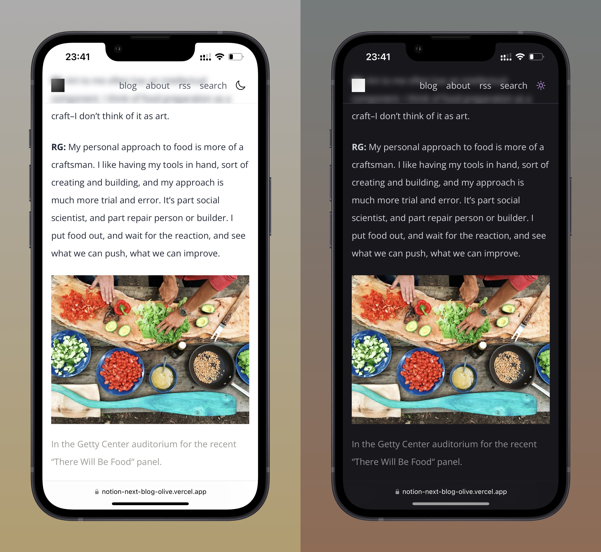

# Notion Next Blog

A notion-powered blog based on [nobelium](https://github.com/craigary/nobelium) but with more feature.

Demo: https://notion-next-blog-olive.vercel.app

## Overview

## Features

**Again, this repo based on [nobelium](https://github.com/craigary/nobelium) but with Next.js 13 and React 18.** 

Thanks to Craig Hart's work!

- Added features:
  - **💫 New style with Tailwind CSS 3.0**
  - **🙈 Reasonable 404 Not Found page**
  - **🌓 Friendly dark mode switcher**
  - ...

Origin Features:

**🚀 &nbsp;Fast and responsive**

- Fast page render and responsive design
- Fast static generation with efficient compiler

**🤖 &nbsp;Deploy instantly**

- Deploy on Vercel in minutes
- Incremental regeneration and no need to redeploy after update the content in notion

**🚙 &nbsp;Fully functional**

- Comments, full width page, quick search and tag filter
- RSS, analytics, web vital... and much more

**🎨 &nbsp;Easy for customization**

- Rich config options, support English & Chinese interface
- Built with Tailwind CSS, easy for customization

**🕸 &nbsp;Pretty URLs and SEO friendly**

## Quick Start

- Star this repo 😉
- Duplicate [this Notion template](https://efficacious-snapdragon-59b.notion.site/d3a1074627994f1b8475de6a919cb09c?v=d73ecce8fc274588b0c4aa775a4db279), and share it to the public
- Fork this project
- Customize `blog.config.js`
- _(Optional)_ Replace `favicon.svg`, and `favicon.ico` in `/public` folder with your own
- Deploy on [Vercel](https://vercel.com), set following environment variables：
  - `NOTION_PAGE_ID` (Required): The ID of the Notion page you previously shared to the web, usually has 32 digits after your workspace address
  - `NOTION_ACCESS_TOKEN` (Optional, not recommended): If you decide not to share your database, you can use token to let Nobelium grab data from Notion database. You can find it in your browser cookies called `token_v2`
    - Keep in mind Notion token is only valid for 180 days, make sure to update manually in vercel dashboard, we probably switch to Official API to resolve this issue in the future. Also, images in Notion database will not properly rendered
- **That's it!** Easy-peasy?

## Todo

- [ ] Refactor with Typescript
- [ ] Improve about/profile page
- [ ] Imporove image previews with [lqip-modern](https://github.com/transitive-bullshit/lqip-modern)
